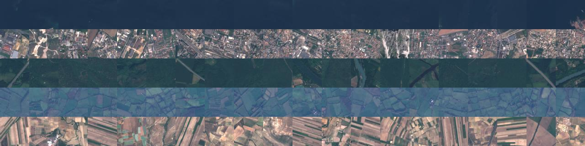

# Ripples in SpaceTime

## Official implementation for: Self-Supervised Spatiotemporal Event Discovery

Code demonstrating the generalization ability of features we obtain from training on interesting change events.

Our change event model is trained on different datasets such as **change events**, **images from Cairo** or **EuroSat dataset**. **[[Training]](#training)**

Using these trained models features are extracted for EuroSat images. **[[Inference]](#inference)**

The generalization is measured using clustering purity. **[[Evaluation]](#evaluation)**


### Requirements
- Pytorch 1.10.0
- torchvision 0.11.1
- scikit-image 0.19.2
- tqdm
- PIL
- numpy

### Pre-trained models
If you do not wish to retrain these models or download our datasets these pre-trained models can be used.

We release 3 pre-trained models

 - **ripplemodel_ours**: Our self-supervised model trained using Change Events [[Google Drive]](https://drive.google.com/file/d/1qP4U6_ms4zcQctYjNcxZBaX4UDPWInBN/view?usp=sharing)
 - **ripplemodel_fulldata**: Our model trained on all images from Cairo [[Google Drive]](https://drive.google.com)
 - **ripplemodel_eurosat**: Our model trained on all images from EuroSat dataset [[Google Drive]](https://drive.google.com/file/d/1s-0qjGYeNJL_pFGFORCv53pIeLkIizuL/view?usp=sharing)

### Dataset
The EuroSat Landcover Classification datasets can be downloaded from their download link.

- [[Direct Download]](https://madm.dfki.de/files/sentinel/EuroSAT.zip) [[GitHub Repo]](https://github.com/phelber/eurosat) (This is **required** for evaluation.) 

We present 2 datasets:

- The spatiotemporal RGB images from sentinel-2 for the city of **Cairo**. [[Google Drive]](https://drive.google.com)
- Temporal slices of **Change Events** from the city of Cairo. [[Google Drive]](https://drive.google.com/file/d/1R2UceJyJ0_iIQxXRmGIYqr0XKx4w79QV/view?usp=sharing)
- This is not needed to download if you are using pre-trained models.

Extract these datasets in the main directory. If not, **remember** to provide paths to these to in the arguments. 

---
## Using the Code
#### Training 
- Use `training.py` to train the models.
- Training on EuroSat only requires the EuroSat dataset. `python3 training.py -bs 256 -e 20 -mt eurosat -ed PATH/TO/EUROSAT`
- Other models can be trained similarly.

```
python3 training.py -bs 256 -e 20 -mt fulldata -fdd PATH/TO/CAIRO
python3 training.py -bs 256 -e 20 -mt ours -fdd PATH/TO/CHANGE_EVENT_SLICES
```

#### Inference
- Use `infer_eurosat.py` to obtain features from various models on the EuroSat dataset.
- This only required EuroSat dataset.
- As stated earlier pre-trained models can be downloaded and used to extract these features

```
python3 infer_eurosat.py -ed PATH/TO/EUROSAT -mt eurosat # other arguments for -mt (model type) can be imnet, fulldata, ours 
```

- This creates a `.npz` file in the directory `eurofeats`. The `.npz` contains features for images from EuroSat that can be used for evaluation.
- To get features for a custom dataset same command can be used, if dataset is set like EuroSat (One level subdirectories with images).

#### Evaluation
For evaluation and visualization we release a jupyter notebook `evaluation_and_visualzation.ipynb`. 
Look at notebook to see how use the features from the previous step to perform evaluation.